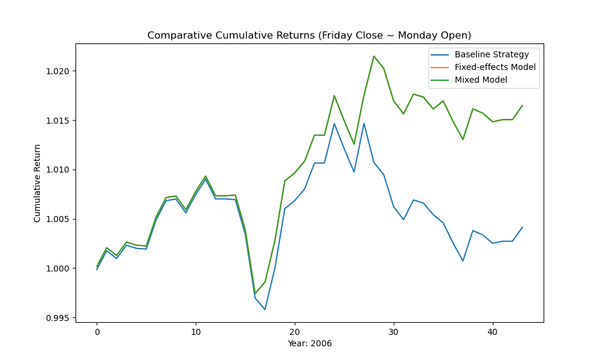
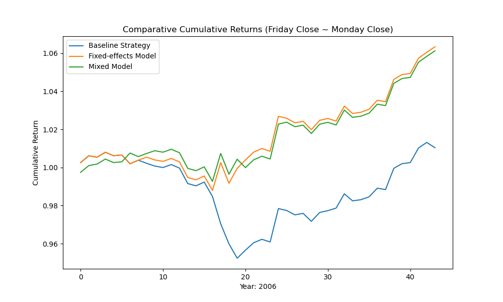

---
header-includes:
  - \usepackage{titling}
  - \pretitle{\vspace{-1.95cm}\begin{center}\Large}
  - \posttitle{\end{center}}
title: "Beyond Friday: Measuring the Ripple Effects into the Monday Mystique"
author: "Evan Kim (STA 440 with Dr. Jiang)"
geometry: "left=1.45cm,right=1.45cm,top=1.45cm,bottom=1.45cm"
fontsize: 11pt
date: "2023-12-18"
output: pdf_document
---

```{r setup, include=FALSE}
knitr::opts_chunk$set(warning = FALSE, message = FALSE, echo = TRUE)

```

## I. Introduction
\vspace{-1mm} 

**Background** \newline
\text{ }\text{ }\text{ }\text{ } The participation of retail investors in the US equities market has seen a remarkable upsurge in recent times. This growth can be attributed to a confluence of factors that have reshaped the investing landscape. Key among these is the advent of mobile app trading platforms such as Robinhood, which have streamlined the process of account opening and investing, even for modest sums; 76% of "Nascent Investors", as defined by BNY Mellon in its 2022 Retail Investor Survey, execute transactions where the average trade size is less than 500.$^1$ Simultaneously, the rise of social media has played a pivotal role in fueling the engagement of younger demographics in stock market investing. Influencer-driven content has not only heightened awareness but has also created a sense of urgency, often rooted in the "fear of missing out", propelling these new investors into the fray.\newline
\text{ }\text{ }\text{ }\text{ } This wave of market entry is not confined to new participants alone. The economic climate shaped by pandemic-era stimulus measures and historically low US benchmark interest rates (near-zero from April 2020 to February 2022) has seen a broad cross-section of the population invest in the stock market. Per the Federal Reserve, US households and nonprofits parked 41% of their total financial assets in "direct and indirect holdings of stocks" as of year-end 2021, nearly an all-time high since 1952.$^2$\newline
\text{ }\text{ }\text{ }\text{ } Amidst this influx of market participants, there is a burgeoning obsession with "beating the market" - that is, achieving an annualized return that surpasses the performance of the S&P 500, often regarded as the most representative of all stock market indices. The quest to outperform the market persists despite evidence that even seasoned finance professionals struggle to do so, with studies showing that 95% cannot "beat the market."$^3$ This was famously highlighted by legendary investor Warren Buffett's 2007 bet, which posited that the S&P 500 index would outperform the curated selections of hedge fund managers, a claim that ultimately held true.$^4$\newline
\text{ }\text{ }\text{ }\text{ } One theory that has captivated the attention of both professional and retail investors alike is the "Monday Effect." This theory suggests that the stock market's performance on Monday will typically follow the preceding Friday's trend. If the market closed up on Friday, the expectation is that the momentum would carry over to Monday, and conversely, if it closed down.$^5$ However, the simplicity of this theory belies its effectiveness. Blindly buying at Friday's close and selling at Monday's close has not demonstrated a reliable way to beat the market in backtested results.$^6$ Moreover, investors, especially inexperienced retail investors, often find it challenging to adhere to such a systematic approach with the necessary discipline, as the psychological barrier of enduring a loss and then persisting with the same strategy the following week, relying solely on the belief in the "Monday Effect" without solid reasoning or informed market insights, is substantial. In previous research, it was established that the "Monday Effect" does not provide a consistent advantage for systematic profits, especially when considering transaction costs. These findings align with the efficient market hypothesis, suggesting that stock prices move randomly and cannot be reliably predicted for profit-making. The periodic nature of stock returns, while interesting, is not a dependable factor for strategic investment decisions, particularly for retail investors who might lack the discipline or market insight to effectively capitalize on such trends.$^7$\newline


**Objective** \newline
\text{ }\text{ }\text{ }\text{ } The primary aim of this report is to evaluate whether a more sophisticated approach to the "Monday Effect" can be devised, transcending the rudimentary method of "blindly" purchasing the S&P 500 index at Friday's close and liquidating at Monday's close. By integrating a selection of variables that are defensible from qualitative, quantitative, and financial-economic standpoints into a model underpinned by statistical rigor, we seek to investigate the potential of deriving tangible benefits from this phenomenon. The objective is to construct a strategy that is informed by a refined understanding of the "Monday Effect," thereby providing a nuanced perspective on market behaviors and trends.\newline
\text{ }\text{ }\text{ }\text{ } The secondary objective of this analysis is to further dive into whether selling at Monday's open or close, after purchasing at Friday's close, offers any benefits. We compare these two strategies in terms of various input variables and back-tested return; Additionally, we explore whether "shorting" could be advantageous for retail investors when implementing the model.\newline
\text{ }\text{ }\text{ }\text{ } The culmination of this report's objectives offers the prospect of invaluable insights for retail investors. These insights are poised to empower investors with sophisticated strategies for navigating and potentially profiting from market patterns. Ultimately, this study aims to provide retail investors with actionable insights, enhancing their ability to navigate the complexities of financial markets with confidence.\newline


## II. Methodology
\vspace{-1mm}

**Timeframe Selection** \newline
\text{ }\text{ }\text{ }\text{ } Our study strategically targets the period from 2003 to present, a decision underpinned by key considerations. Spanning two decades, this extensive timeframe ensures our analysis is not overly biased towards any specific market phase, encompassing diverse economic conditions including both pre- and post-2008 financial crisis eras. We consciously exclude the dot-com era, a time largely before the widespread entry of retail investors into the market, to focus on more structurally consistent and representative market dynamics. Following the dot-com bubble period, the trading landscape experienced significant technological advancements and regulatory changes, especially after the 2008 crisis, aligning this period closely with current market mechanisms. Additionally, this era captures the evolution of investor behavior and market sentiment, shaped by new financial instruments and global economic shifts. The availability and consistency of data from 2003 onward, a total 919 weekends, bolster the robustness and comprehensiveness of our analysis. Including the recent pandemic-induced market fluctuations further adds contemporary relevance to our study. Thus, the selected timeline offers an ideal mix of historical breadth and modern applicability, essential for our investigation. (Link to GitHub repo: [https://github.com/wujehevankim/sta440finalproject](https://github.com/wujehevankim/sta440finalproject))\newline


**Dataset & Variables** \newline
\text{ }\text{ }\text{ }\text{ } The backbone of our study is the dataset of SPY (S&P 500 ETF) prices, intentionally chosen instead of the S&P 500 index itself. We opted for the SPY ETF as it represents a more practical and accessible option for retail investors, mirroring the performance of the S&P 500 index while being directly tradable.  This dataset, sourced from Yahoo Finance, encompasses essential metrics such as open, low, high, close, and volume, covering our defined timeframe. To ensure the integrity and relevance of our data, we concentrated on weeks where the market was active on Monday, Thursday, and Friday, deliberately excluding weeks affected by holidays or other anomalies. This approach to data filtration is critical for maintaining consistency in the dataset, a crucial aspect for the accuracy and reliability of our analysis.\newline
\text{ }\text{ }\text{ }\text{ } Our response variables of interest were formulated to be binary: whether Monday's open is higher than Friday's close, and whether Monday's close is higher than Friday's close. This binary approach is strategically chosen for several reasons. Firstly, it aligns with the core objective of our analysis – to ascertain the presence and directionality of the "Monday Effect," rather than quantifying its magnitude. By focusing on the direction of price movement (up or down), we can more directly test the hypothesis that Friday's market sentiment carries over to Monday. Secondly, binary variables facilitate a clearer interpretation of results, especially beneficial for retail investors who might seek straightforward, actionable insights. This approach also mitigates the complexities and noise often associated with continuous data, such as percentage returns, which can be influenced by a myriad of external factors. By distilling our response variables to a binary format, we aim to isolate the effect of our predictors more effectively, providing a focused lens through which the "Monday Effect" can be examined.\newline
\text{ }\text{ }\text{ }\text{ } For potential predictor variables, we first considered market events that typically occur on Fridays and influence the entire SPY index. One such variable is the performance of the US equities market on Friday, represented by the difference between Friday's and Thursday's closing levels. Another aspect is Friday's intraday movement, evaluated through the change between Friday's open and close, both as a unit change in price and as an indicator of directional movement (up or down).\newline
\text{ }\text{ }\text{ }\text{ } A notable Friday event is the "triple witching day," which occurs quarterly. This phenomenon, known for its potential to heighten market volatility and liquidity, refers to the simultaneous expiration of stock index futures, stock index options, and stock options. This event can significantly impact market dynamics, as evidenced by the 1987 triple witching day crash, which is popularly referenced by investors till this day. To rigorously test whether triple witching days have statistically meaningful association with SPY's open or close level on Monday, we include it as one of the potential predictor variables.$^8$\newline
\text{ }\text{ }\text{ }\text{ } Another regular Friday occurrence is the release of Nonfarm Payrolls data, typically on the first Friday of each month. This economic indicator can sway market expectations, reflecting on the health of the US job market. We categorized Nonfarm Payrolls data based on how the actual figures compared to the market consensus just before their release, thus creating a categorical variable for our analysis.\newline
\text{ }\text{ }\text{ }\text{ } The University of Michigan Consumer Sentiment Index, released every other Friday, is a pivotal element in our analysis. This index, on a scale from 1 to 100, gauges consumer confidence, impacting the SPY index by reflecting economic outlooks and spending potential. In our study, we utilize the index in both continuous and binary formats. The continuous format employs the actual index values to examine correlations with SPY price movements. For the binary format, we compare the index's actual figures against market expectations, determining if consumer sentiment is above or below these projections.\newline
\text{ }\text{ }\text{ }\text{ } Finally, while not a Friday-specific event, our analysis incorporates the Federal Open Market Committee (FOMC) meetings, a significant monetary policy event that impacts financial markets comprehensively. Typically held on Wednesdays, these meetings occur eight times a year and are instrumental in setting the U.S. monetary policy. The decisions and outlooks communicated during these meetings, specifically 'hawkish' or 'dovish' stances, exert a profound influence on investor sentiment and stock market dynamics. (A 'hawkish' stance, indicating potential interest rate increases or other tightening measures, can create expectations of a stronger economy but also lead to reduced liquidity in the markets.) The direct impact of FOMC decisions on the subsequent Monday's market performance is a point of analysis in our study, as we aim to assess its immediate effect on the SPY index and determine its statistical significance within our model.\newline


**Exploratory Data Analysis** \newline
\text{ }\text{ }\text{ }\text{ } Our initial phase of exploratory data analysis focuses on evaluating the SPY's Monday opening and closing prices in relation to the preceding Friday's closing price. This examination involves analyzing the ratios of Monday's opening and closing prices to Friday's closing price. Specifically, a ratio exceeding 1 would imply that the market opened or closed at a higher value compared to Friday's close. Our analysis, covering the period from 2003 to the present, reveals that these ratios are roughly symmetrical for both scenarios, suggesting a balanced distribution in the overall market trends. (Figure 1 below) Moreover, we delve into the binary variables of whether Monday's opening price is greater than Friday's closing price, and similarly for Monday's closing price. The proportion breakdown shows that in 54.3% of instances, Monday's opening price exceeded Friday's close, and in 54.2% of cases, Monday's closing price was higher than Friday's close. (See Appendix - Figure 2) This near-equitable split indicates a lack of significant bias, which is crucial as we proceed with logistic regression analyses. The logistic regression, with binary response variables and a logit link, will be based on this observed balance in the data. This finding is instrumental in guiding our further statistical investigations, ensuring our approach is grounded in the empirical evidence of market behaviors.\newline

```{r, echo=FALSE, warning=FALSE, message=FALSE, fig.width=7.9, fig.height=2.5}
library(ggplot2)
library(patchwork)
df4 <- read.csv('data/addingFOMC/SPY_ready_for_analysis_triple_witch_NFP_CSI_FOMC_with_month.csv', header = TRUE)
df4$MondayCloseToFridayCloseRatio <- df4$FollowingWeekMondayClose / df4$PrecedingWeekFridayClose

p1 <- ggplot(df4, aes(x = MondayOpenToFridayCloseRatio)) + 
    geom_density(fill = "blue", alpha = 0.5) +
  scale_x_continuous(trans = 'log', limits = c(0.95, 1.05)) +
    labs(subtitle = "Density of Monday Open to Friday Close Ratio",
         x = "Monday Open to Friday Close Ratio",
         y = "Density")

p2 <- ggplot(df4, aes(x = MondayCloseToFridayCloseRatio)) + 
    geom_density(fill = "pink", alpha = 0.5) +
    scale_x_continuous(trans = 'log', limits = c(0.95, 1.05)) +
    labs(subtitle = "Density of Monday Close to Friday Close Ratio",
         x = "Monday Close to Friday Close Ratio",
         y = "Density")


p1/p2
```
\text{ }\text{ }\text{ }\text{ } We next explore the relationship between "Nonfarm Payrolls Shocks" — defined as Nonfarm Payrolls economic data figures releasing more than 50% below market consensus directly preceding the release — and Monday's market prices. We find that such shocks seems to be associated with a noticeable increase in the proportion of instances where Monday's closing price is lower than Friday's close. Interestingly enough, the pattern is neither noticeable or discernible for whether Monday's opening price came it higher or lower than Friday's closing price. (See Appendix - Figures 3, 4) This trend suggests that significant macroeconomic indicators like Nonfarm Payrolls may stay "top of mind" of the market in the medium term, affecting prices up to Monday's close.\newline


\vspace{-3mm}

\text{ }\text{ }\text{ }\text{ } Similarly, we explore the relationship between "University of Michigan Consumer Sentiment Index (CSI) Shocks" — defined as CSI economic data figures releasing more than 5 below market consensus directly preceding the release — and Monday's market prices. The University of Michigan Consumer Sentiment Index (CSI) operates on a scale from 1 to 100, with higher values indicating more favorable consumer perceptions of the economy and lower values reflecting more pessimistic outlooks. Based on the pre-defined threshold for a "CSI Shock", we discovered a notable disparity in the proportions of instances where the Monday opening price was lower versus higher than Friday's close, particularly when comparing scenarios of CSI being classified as non-shock versus shock. Intriguingly, a chi-square test revealed this difference to be statistically significant, with a p-value of 0.013, underscoring the potential impact of CSI shocks on market behavior at the start of the week. (See Appendix - Figures 5, 6) In addition, in terms of the relationship between Monday's closing price relative to Friday's close, when considering `CSIActualMinusExpected` (the difference between the released CSI print and market consensus) as the continuous variable of interest, a distinct variation in the distribution's mode or peak becomes evident. This variation is particularly noticeable when comparing instances where the Monday closing price was higher versus those where it was lower. (See Appendix - Figure 7)\newline
\text{ }\text{ }\text{ }\text{ } Furthermore, we categorize the Federal Reserve's interest rate decisions into five distinct groups: "SuperCut" for reductions of 50 basis points (bps) or more, "Cut" for a 25bps reduction, "Pause" for no change, "Hike" for a 25bps increase, and "SuperHike" for increases of 50bps or more. When examining the impact of these FOMC actions on the stock market, specifically in relation to Monday's opening and closing prices, we find no statistically significant differences in the proportion breakdown across these five categories. This contrasts with the notable disparities observed in relation to Nonfarm Payrolls (NFP) and Consumer Sentiment Index (CSI) impacts, as previously discussed. (See Appendix - Figures 8~11)
\text{ }\text{ }\text{ }\text{ } Considering the influence of months on stock market fluctuations (often attributed to cyclical trends and seasonal investor activities) we explored the impact of random effects associated with different months. Notably, we observed non-negligible differences in these proportions, with chi-square tests indicating borderline statistical significance: a p-value of 0.062 for Monday's open price being higher than Friday's close and 0.086 for Monday's close price being higher than Friday's close. Consequently, in our final modeling, we included both fixed-effects and mixed-effects models for Monday's open and close prices, resulting in a total of four models. This approach allows for a comprehensive comparison of simulated return results, accommodating the potential variability introduced by monthly market dynamics. (See Appendix - Figures 12, 13)\newline


**Model Selection Using Forward Selection** \newline
\text{ }\text{ }\text{ }\text{ } Logistic regression serves as a fundamental statistical tool, particularly apt for scenarios involving binary outcomes, such as the "Monday Effect" in our study. It offers a way to model the probability of a binary response based on one or more predictor variables. This approach is particularly fitting for our analysis, as it allows for the exploration of how various market indicators and economic events influence the likelihood of Monday's opening or closing prices being higher than Friday's close. Logistic regression's capacity to handle binary outcomes, coupled with its ability to incorporate a range of continuous and categorical variables, makes it an ideal choice for dissecting the complex interplay of factors that drive market movements. By using this method, we can quantify the strength and direction of the relationships between our predictors and the market's opening and closing behaviors, providing a robust framework for understanding and forecasting market dynamics.\newline
\text{ }\text{ }\text{ }\text{ } In our pursuit to identify the most appropriate models for analyzing the "Monday Effect," we employed a forward selection approach for both our response variables: whether Monday's open price is higher than Friday's close and whether Monday's close price is higher than Friday's close. This method started with a null model, progressively adding predictors based on their statistical significance and contribution to model fit, guided by the principle of minimizing the Akaike Information Criterion (AIC). By minimizing the AIC, we aimed to find a model that best explains the data with a minimal number of parameters, striking a balance between model simplicity and explanatory power. Our dataset, enriched with diverse market indicators and event flags, served as a robust foundation for this process.\newline
\text{ }\text{ }\text{ }\text{ } For the response variable `MondayOpenHigherThanFridayClose`, we initially considered an extensive set of potential predictors, including market movements on Fridays, impact of economic indicators like Nonfarm Payrolls (NFP) and the Consumer Sentiment Index (CSI), and FOMC decisions. The forward selection method meticulously evaluated each predictor's influence, ultimately narrowing down to a model that included factors like the last Friday of the month, CSI shocks, and unemployment rate changes. This model was further refined into two distinct versions: a non-random model focusing on fixed effects and a mixed model incorporating random effects based on the month, acknowledging the seasonal variations in stock market behavior. Similarly, for `MondayCloseHigherThanFridayClose`, we applied the same rigorous forward selection process. The resulting models captured key predictors such as NFP shocks, triple witching days, and CSI impacts, again resulting in both non-random and mixed model variants. The mixed model, in particular, accounted for monthly variances, reflecting the nuanced interplay of temporal factors in market dynamics.\newline
\text{ }\text{ }\text{ }\text{ } Further details and the precise mathematical formulation of the four models will be meticulously outlined and interpreted in the following section, offering an in-depth perspective on their structure and implications.\newline


## III. Model Specifications
**Monday Open Price > Friday Close Price** \newline
\text{ }\text{ }\text{ }\text{ } For the binary response variable `MondayOpenHigherThanFridayClose`, our analysis led to the formulation of both fixed-effects and random-effects logistic regression models. The models identified several significant predictor variables. The binary predictors — `isItLastFridayOfTheMonth`, `wasFridayCloseHigherThanThursdayHigh`, and `CSIOutcomeIsShock` — denote categorical influences, while `CSIActualMinusExpected` and `UnemploymentActualMinusPreviousInPercent` are continuous, providing a measure of quantitative impact on the probability of Monday's opening price being higher than Friday's close.\newline
\text{ }\text{ }\text{ }\text{ } In the fixed-effects model, the coefficient for `isItLastFridayOfTheMonth` is positive, indicating a higher likelihood of Monday's open being greater than Friday's close when the preceding Friday was the last Friday of the month. Conversely, `wasFridayCloseHigherThanThursdayHigh` and `CSIOutcomeIsShock` have negative coefficients, suggesting a reduced likelihood under these conditions. Notably, the magnitude of the coefficient for `CSIOutcomeIsShock` is the largest, signifying a strong association with the response variable. The mixed-effects model incorporates the same predictors with slightly different coefficients and includes a random effect for the variable Month, capturing the variability across different months. Here too, the `CSIOutcomeIsShock` variable stands out with the highest coefficient magnitude, reflecting its substantial association with Monday's opening price behavior.\newline

\text{Fixed-Effects Model:}
\vspace{-9mm}
\begin{align*}
\Pr(\mathit{MondayOpenHigherThanFridayClose}_i = 1) &= \pi_i \\
\log\left(\frac{\pi_i}{1 - \pi_i}\right) &= 0.241 + 0.441 \cdot \mathit{isItLastFridayOfTheMonth}_i \\
&\quad - 0.388 \cdot \mathit{wasFridayCloseHigherThanThursdayHigh}_i \\
&\quad - 1.440 \cdot \mathit{CSIOutcomeIsShock}_i \\
&\quad - 0.088 \cdot \mathit{CSIActualMinusExpected}_i \\
&\quad - 0.709 \cdot \mathit{UnemploymentActualMinusPreviousInPercent}_i
\end{align*}
\vspace{5mm}
\text{Mixed-Effects Model:}
\vspace{-9mm}
\begin{align*}
\Pr(\mathit{MondayOpenHigherThanFridayClose}_i = 1) &= \pi_i \\
\log\left(\frac{\pi_i}{1 - \pi_i}\right) &= 0.216 + 0.441 \cdot \mathit{isItLastFridayOfTheMonth}_i \\
&\quad - 0.388 \cdot \mathit{wasFridayCloseHigherThanThursdayHigh}_i \\
&\quad - 1.450 \cdot \mathit{CSIOutcomeIsShock}_i \\
&\quad - 0.089 \cdot \mathit{CSIActualMinusExpected}_i \\
&\quad - 0.705 \cdot \mathit{UnemploymentActualMinusPreviousInPercent}_i \\
&\quad + u_{\text{Month}_i}
\end{align*}

\vspace{6mm}

**Monday Close Price > Friday Close Price** \newline
\text{ }\text{ }\text{ }\text{ } For the binary response variable `MondayCloseHigherThanFridayClose`, we similarly include both fixed-effects and random-effects specifications. The significant predictors for these models are a mix of binary variables — `NFPOutcomeIsShock`, `wasFridayHighLowerThanThursdayLow`, `fridayWasATripleWitchDay`, and `wasFridayIntradayPositive` — one continuous variable (`CSIActualMinusExpected`), and one categorical variable (`CSIOutcome`) that encompass various CSI outcomes.\newline
\text{ }\text{ }\text{ }\text{ } In the fixed-effects model, negative coefficients for `NFPOutcomeIsShock`, `wasFridayHighLowerThanThursdayLow`, and `fridayWasATripleWitchDay` suggest these conditions are associated with a lower probability of Monday's close being higher than Friday's. Conversely, the positive coefficients for the `CSIOutcomeBaseline` and `CSIOutcomeUpbeat` indicate an association with an increased probability. The variable `CSIOutcomeUpbeat` carries the most significant weight in terms of coefficient magnitude. The mixed-effects model includes the same predictors and shows that the random variability attributed to `Month` can capture additional nuances in the data. The magnitude of the `CSIOutcomeUpbeat` coefficient is notably large here as well, suggesting a strong association with the probability of Monday's closing price being higher than Friday's close within the random-effects framework as well.\newline


\text{Fixed-Effects Model:}
\vspace{-9mm}
\begin{align*}
\Pr(\mathit{MondayCloseHigherThanFridayClose}_i = 1) &= \pi_i \\
\log\left(\frac{\pi_i}{1 - \pi_i}\right) &= 0.300 -1.230 \cdot \mathit{NFPOutcomeIsShock}_i \\
&\quad - 0.692 \cdot \mathit{wasFridayHighLowerThanThursdayLow}_i \\
&\quad - 0.473 \cdot \mathit{fridayWasATripleWitchDay}_i \\
&\quad - 0.240 \cdot \mathit{CSIActualMinusExpected}_i \\
&\quad + 0.332 \cdot \mathit{CSIOutcomeBaseline}_i \\
&\quad - 1.568 \cdot \mathit{CSIOutcomeShock}_i \\
&\quad + 1.762 \cdot \mathit{CSIOutcomeUpbeat}_i \\
&\quad - 0.228 \cdot \mathit{wasFridayIntradayPositive}_i
\end{align*}
\vspace{5mm}
\text{Mixed-Effects Model:}
\vspace{-9mm}
\begin{align*}
\Pr(\mathit{MondayCloseHigherThanFridayClose}_i = 1) &= \pi_i \\
\log\left(\frac{\pi_i}{1 - \pi_i}\right) &= 0.283 -1.222 \cdot \mathit{NFPOutcomeIsShock}_i \\
&\quad - 0.697 \cdot \mathit{wasFridayHighLowerThanThursdayLow}_i \\
&\quad - 0.457 \cdot \mathit{fridayWasATripleWitchDay}_i \\
&\quad - 0.245 \cdot \mathit{CSIActualMinusExpected}_i \\
&\quad + 0.335 \cdot \mathit{CSIOutcomeBaseline}_i \\
&\quad - 1.603 \cdot \mathit{CSIOutcomeShock}_i \\
&\quad + 1.778 \cdot \mathit{CSIOutcomeUpbeat}_i \\
&\quad - 0.229 \cdot \mathit{wasFridayIntradayPositive}i \\
&\quad + u{\text{Monthclose}_i}
\end{align*}


\vspace{5mm}
\text{ }\text{ }\text{ }\text{ } This structured overview provides a clear interpretation of how each variable is associated with the likelihood of Monday's closing price being higher than Friday's close. The coefficients reflect the strength of these associations, with their signs indicating the direction of the association, and their magnitude suggesting the strength of the relationship within the context of the model. Detailed R outputs for these models, including the p-values and statistical significance of each variable, as well as the final AIC metric for model comparison, are meticulously documented in Appendix - Figures 14 through 17. \newline


## IV. Results
\text{ }\text{ }\text{ }\text{ } With two models established for each binary response variable — `MondayOpenHigherThanFridayClose` and `MondayCloseHigherThanFridayClose` — we proceed to compare the simulated returns of the "blind strategy" against those of the fixed and mixed effects models. The "blind strategy" refers to the traditional approach of buying at Friday's close and selling at Monday's close each week. Our comparison extends over a twenty-year period from 2003 to 2023, where we analyze annualized simulated returns to extract meaningful insights and discern the potential efficacy of each strategy. This analysis aims to determine whether the sophisticated models outperform the simple heuristic of the "Monday Effect" across different time frames.\newline

**Monday Open & Friday Close** \newline
\text{ }\text{ }\text{ }\text{ } The table below ranks the performance of three investment strategies — blind, fixed-effect, and mixed-effects — annually, with 1 indicating the best and 3 the worst, noting that ties are possible. The simulated results for the fixed-effect and mixed-effect models are based on buying Friday close and selling Monday open when the model predicts `MondayOpenHigherThanFridayClose = 1`, and otherwise selling Friday close and buying Monday open, effecting shorting. Upon aggregating average ranks across our period of interest, the fixed-effects model boasts the superior average rank, securing the first place 13 times, outperforming the mixed-effects model's 10 top placements, and the blind strategy's 6. \newline
\begin{table}[H]
\centering
\begin{tabular}{cccc}
\hline
\textbf{Year} & \textbf{Blind Strategy} & \textbf{Fixed-effects Model} & \textbf{Mixed-effects Model} \\ \hline
2003 & 3 & 1 & 1 \\
2004 & 3 & 1 & 1 \\
2005 & 3 & 1 & 1 \\
2006 & 3 & 1 & 1 \\
2007 & 1 & 2 & 2 \\
2008 & 1 & 2 & 3 \\
2009 & 3 & 1 & 2 \\
2010 & 1 & 2 & 2 \\
2011 & 3 & 2 & 1 \\
2012 & 2 & 1 & 3 \\
2013 & 3 & 1 & 2 \\
2014 & 1 & 3 & 2 \\
2015 & 2 & 1 & 1 \\
2016 & 2 & 1 & 1 \\
2017 & 2 & 1 & 1 \\
2018 & 1 & 3 & 2 \\
2019 & 3 & 1 & 2 \\
2020 & 3 & 1 & 2 \\
2021 & 3 & 2 & 1 \\
2022 & 3 & 1 & 1 \\
2023 & 1 & 2 & 2 \\ \hline
\textit{Avg. Rank} & \textit{2.24} & \textit{1.48} & \textit{1.62} \\ \hline
\end{tabular}
\caption{Annual Ranking of Strategies by Simulated Returns}
\label{table:strategy_rank}
\end{table}


**Monday Close & Friday Close** \newline
\text{ }\text{ }\text{ }\text{ } The table below ranks the performance of three investment strategies — blind, fixed-effect, and mixed-effects — annually, with 1 indicating the best and 3 the worst, noting that ties are possible. The simulated results for the fixed-effect and mixed-effect models are based on buying Friday close and selling Monday close when the model predicts `MondayCloseHigherThanFridayClose = 1`, and otherwise selling Friday close and buying Monday close, effecting shorting. Upon aggregating average ranks across our period of interest, the fixed-effects model boasts the superior average rank, securing the first place 10 times, outperforming the mixed-effects model's 7 top placements, and the blind strategy's 5. \newline
\begin{table}[H]
\centering
\begin{tabular}{cccc}
\hline
\textbf{Year} & \textbf{Blind Strategy} & \textbf{Fixed-effects Model} & \textbf{Mixed-effects Model} \\ \hline
2003 & 3 & 2 & 1 \\
2004 & 3 & 2 & 1 \\
2005 & 3 & 2 & 1 \\
2006 & 3 & 1 & 2 \\
2007 & 1 & 3 & 2 \\
2008 & 3 & 1 & 1 \\
2009 & 1 & 2 & 3 \\
2010 & 2 & 1 & 3 \\
2011 & 3 & 2 & 1 \\
2012 & 3 & 1 & 2 \\
2013 & 3 & 1 & 2 \\
2014 & 3 & 1 & 2 \\
2015 & 1 & 2 & 3 \\
2016 & 1 & 3 & 2 \\
2017 & 2 & 3 & 1 \\
2018 & 3 & 1 & 2 \\
2019 & 1 & 2 & 3 \\
2020 & 3 & 1 & 2 \\
2021 & 2 & 1 & 3 \\
2022 & 3 & 2 & 1 \\
2023 & 2 & 1 & 3 \\ \hline
\textit{Avg. Rank} & \textit{2.33} & \textit{1.67} & \textit{1.95} \\ \hline
\end{tabular}
\caption{Annual Ranking of Strategies by Simulated Returns}
\label{table:strategy_rank}
\end{table}


\text{ }\text{ }\text{ }\text{ } Throughout our analysis, it's evident that both the fixed and mixed-effects models have consistently outperformed the baseline strategy that operates on the principle of the "Monday Effect," which advocates for buying on Friday close and selling on Monday. Notably, during the tumultuous period surrounding the Great Financial Crisis, particularly in the years 2007 through 2009, the models' performance faltered, highlighting a potential limitation in their ability to navigate extreme market conditions. Moreover, during significantly bullish years like 2018 and 2023, the models again fell short, suggesting that in years marked by strong upward trends, the predictive power of the models may be less effective, possibly due to overfitting or a failure to capture the momentum-driven market behavior. Detailed time-series plots charting the returns from 2003 to 2023 will be available in the appendix, offering a visual representation of the models' annual performance relative to the baseline strategy.\newline


## V. Discussion
\text{ }\text{ }\text{ }\text{ } Our findings indicate that while both fixed and mixed-effects models show promise in outperforming the blind strategy, they are not without limitations. For instance, during periods of high market turbulence, such as the financial crisis of 2007-2009, the models' predictive power diminishes, suggesting that they may not fully account for the complexities of extreme market behaviors. Moreover, the underperformance of the models during bullish years like 2018 and 2023 raises questions about their ability to adapt to persistent market trends, highlighting a potential need for dynamic modeling that can accommodate momentum-driven market changes. The practical implications of these findings suggest that while the adoption of sophisticated models may offer a more informed investment strategy over the blind application of the "Monday Effect," investors should remain cautious. Retail investors, in particular, must recognize the importance of understanding the underlying market conditions and the limitations of any model. Our study underscores the potential for statistical models to enhance investment strategies, but it also emphasizes the necessity for investors to maintain a critical perspective, especially during atypical market conditions. As we move forward, the continuous refinement of these models, including machine learning algorithms or real-time data analysis, could provide further advancements in the field.


\newpage
## VI. Appendix
\vspace{5mm}

_Figure 2: Proportion Breakdown of Monday Open and Close Relative to Friday Close_ \newline
\text{ }\text{ }\text{ }\text{ }  For both Monday's opening and closing prices relative to the previous Friday's close, the occurrences are nearly evenly split, indicating a roughly half-and-half distribution between cases where prices were higher and those where they were lower.
```{r, echo=FALSE, warning=FALSE, message=FALSE}
#1 vs 0 proportion break down table with percentages for df4$WasMondayOpenHigherThanFridayClose and df4$WasMondayCloseHigherThanFridayClose

# Count occurrences for WasMondayOpenHigherThanFridayClose
table_open <- table(df4$WasMondayOpenHigherThanFridayClose)

# Convert counts to proportions and then to percentages for WasMondayOpenHigherThanFridayClose
percentage_open <- prop.table(table_open) * 100

# Count occurrences for WasMondayCloseHigherThanFridayClose
table_close <- table(df4$WasMondayCloseHigherThanFridayClose)

# Convert counts to proportions and then to percentages for WasMondayCloseHigherThanFridayClose
percentage_close <- prop.table(table_close) * 100


formatted_yes_open <- sprintf("%.1f%%", percentage_open[2])
formatted_no_open <- sprintf("%.1f%%", percentage_open[1])
formatted_yes_close <- sprintf("%.1f%%", percentage_close[2])
formatted_no_close <- sprintf("%.1f%%", percentage_close[1])


breakdown_table <- data.frame(
  Category = c('Monday Open Price > Friday Close Price', 'Monday Close Price > Friday Close Price'),
  Yes = c(formatted_yes_open, formatted_yes_close),
  No = c(formatted_no_open, formatted_no_close)
  
)
library(dplyr)
library(knitr)
# Print the table
kable(breakdown_table, format = "latex")

```


\vspace{5mm}
_Figure 3: Proportion Breakdown of Monday Close and Friday Close in relation to Nonfarm Payrolls Shocks_ \newline
```{r, echo=FALSE, warning=FALSE, message=FALSE}

df4$NFPOutcomeIsShock <- ifelse(df4$NFPOutcome == "Shock", 1, 0)


#1. breakdown table of WasMondayCloseHigherThanFridayClose (1 vs 0) and NFPOutcomeIsShock (1 vs 0)
breakdown_table_monday_close_vs_nfp_shock <- table(df4$WasMondayCloseHigherThanFridayClose, df4$NFPOutcomeIsShock)
rownames(breakdown_table_monday_close_vs_nfp_shock) <- c("Monday Close Lower Than Friday Close", "Monday Close Higher Than Friday Close")
colnames(breakdown_table_monday_close_vs_nfp_shock) <- c("Nonfarm Payrolls Non-shock", "Nonfarm Payrolls Shock")
breakdown_table_column_percentages2 <- prop.table(breakdown_table_monday_close_vs_nfp_shock, 2) * 100
#print(breakdown_table_column_percentages)
breakdown_table_column_percentages_df2 <- as.data.frame.matrix(breakdown_table_column_percentages2)

# Format each value to one decimal place with a percentage sign
breakdown_table_column_percentages_df_formatted2 <- data.frame(lapply(breakdown_table_column_percentages_df2, function(x) sprintf("%.1f%%", x)))

# Print the formatted dataframe
#print(breakdown_table_column_percentages_df_formatted)


breakdown_table_WasMondayCloseHigherThanFridayClose_vs_NFPOutcomeIsShock <- data.frame(
  . = c("Monday Close Lower Than Friday Close", "Monday Close Higher Than Friday Close"),
  NFP_Nonshock = c(breakdown_table_column_percentages_df_formatted2[1][[1]][1], breakdown_table_column_percentages_df_formatted2[1][[1]][2]),
  NFP_Shock = c(breakdown_table_column_percentages_df_formatted2[2][[1]][1], breakdown_table_column_percentages_df_formatted2[2][[1]][2])
  
)

library(dplyr)
library(kableExtra)
library(knitr)
# Print the table
# caption = , 
kable(breakdown_table_WasMondayCloseHigherThanFridayClose_vs_NFPOutcomeIsShock, format = "latex")
```

\vspace{10mm}

_Figure 4: Proportion Breakdown of Monday Open and Friday Close in relation to Nonfarm Payrolls Shocks_ \newline
```{r, echo=FALSE, warning=FALSE, message=FALSE}
df4$NFPOutcomeIsShock <- ifelse(df4$NFPOutcome == "Shock", 1, 0)


#1. breakdown table of WasMondayOpenHigherThanFridayClose (1 vs 0) and NFPOutcomeIsShock (1 vs 0)
breakdown_table_monday_open_vs_nfp_shock <- table(df4$WasMondayOpenHigherThanFridayClose, df4$NFPOutcomeIsShock)
rownames(breakdown_table_monday_open_vs_nfp_shock) <- c("Monday Open Lower Than Friday Close", "Monday Open Higher Than Friday Close")
colnames(breakdown_table_monday_open_vs_nfp_shock) <- c("Nonfarm Payrolls Non-shock", "Nonfarm Payrolls Shock")
breakdown_table_column_percentages <- prop.table(breakdown_table_monday_open_vs_nfp_shock, 2) * 100
#print(breakdown_table_column_percentages)
breakdown_table_column_percentages_df <- as.data.frame.matrix(breakdown_table_column_percentages)

# Format each value to one decimal place with a percentage sign
breakdown_table_column_percentages_df_formatted <- data.frame(lapply(breakdown_table_column_percentages_df, function(x) sprintf("%.1f%%", x)))

# Print the formatted dataframe
#print(breakdown_table_column_percentages_df_formatted)


breakdown_table_WasMondayOpenHigherThanFridayClose_vs_NFPOutcomeIsShock <- data.frame(
  . = c("Monday Open Lower Than Friday Close", "Monday Open Higher Than Friday Close"),
  NFP_Nonshock = c(breakdown_table_column_percentages_df_formatted[1][[1]][1], breakdown_table_column_percentages_df_formatted[1][[1]][2]),
  NFP_Shock = c(breakdown_table_column_percentages_df_formatted[2][[1]][1], breakdown_table_column_percentages_df_formatted[2][[1]][2])
  
)

library(dplyr)
library(knitr)
# Print the table
kable(breakdown_table_WasMondayOpenHigherThanFridayClose_vs_NFPOutcomeIsShock, format = "latex")


```


\vspace{20mm}
_Figure 5: Proportion Breakdown of Monday Open and Friday Close in relation to CSI Shocks_ \newline
```{r, echo=FALSE, warning=FALSE, message=FALSE}
df4$CSIOutcomeIsShock <- ifelse(df4$CSIOutcome == "Shock", 1, 0)


#1. breakdown table of WasMondayOpenHigherThanFridayClose (1 vs 0) and CSIOutcomeIsShock (1 vs 0)
breakdown_table_monday_open_vs_csi_shock <- table(df4$WasMondayOpenHigherThanFridayClose, df4$CSIOutcomeIsShock)
rownames(breakdown_table_monday_open_vs_csi_shock) <- c("Monday Open Lower Than Friday Close", "Monday Open Higher Than Friday Close")
colnames(breakdown_table_monday_open_vs_csi_shock) <- c("Consumer Sentiment Index Non-shock", "Consumer Sentiment Index Shock")
breakdown_table_column_percentages_csi <- prop.table(breakdown_table_monday_open_vs_csi_shock, 2) * 100
#print(breakdown_table_column_percentages)
breakdown_table_column_percentages_df_csi <- as.data.frame.matrix(breakdown_table_column_percentages_csi)

# Format each value to one decimal place with a percentage sign
breakdown_table_column_percentages_df_formatted_csi <- data.frame(lapply(breakdown_table_column_percentages_df_csi, function(x) sprintf("%.1f%%", x)))

# Print the formatted dataframe
#print(breakdown_table_column_percentages_df_formatted)


breakdown_table_WasMondayOpenHigherThanFridayClose_vs_CSIOutcomeIsShock <- data.frame(
  . = c("Monday Open Lower Than Friday Close", "Monday Open Higher Than Friday Close"),
  CSI_Nonshock = c(breakdown_table_column_percentages_df_formatted_csi[1][[1]][1], breakdown_table_column_percentages_df_formatted_csi[1][[1]][2]),
  CSI_Shock = c(breakdown_table_column_percentages_df_formatted_csi[2][[1]][1], breakdown_table_column_percentages_df_formatted_csi[2][[1]][2])
  
)


library(knitr)
# Print the table
kable(breakdown_table_WasMondayOpenHigherThanFridayClose_vs_CSIOutcomeIsShock, format = "latex")


```

\vspace{20mm}
_Figure 6: Comparative Analysis of CSI Shock Versus Non-Shock on the Incidence of Monday's Opening Price Surpassing Friday's Close (Chi-squared Test Results)_ \newline
```{r, echo=FALSE, warning=FALSE, message=FALSE}
#also a chi-square test on proportion of WasMondayOpenHigherThanFridayClose=1 and WasMondayOpenHigherThanFridayClose=0 being the same between CSIOutcomeIsShock=1 and CSIOutcomeIsShock=0
chi_square_test_WasMondayOpenHigherThanFridayClose_vs_CSIOutcomeIsShock <- chisq.test(breakdown_table_monday_open_vs_csi_shock)

# Print the results of the Chi-Square Test
print(chi_square_test_WasMondayOpenHigherThanFridayClose_vs_CSIOutcomeIsShock)
```

\vspace{20mm}
_Figure 7: Comparative Distribution of CSIActualMinusExpected: Delineating Monday's Closing Price Above Versus Below Friday's Close_ \newline
```{r, echo=FALSE, warning=FALSE, message=FALSE, fig.width=9, fig.height=4}
#also a chi-square test on proportion of WasMondayOpenHigherThanFridayClose=1 and WasMondayOpenHigherThanFridayClose=0 being the same between CSIOutcomeIsShock=1 and CSIOutcomeIsShock=0
library(ggplot2)
ggplot(df4, aes(x = CSIActualMinusExpected, fill = factor(WasMondayCloseHigherThanFridayClose))) + 
  geom_density(alpha = 0.5) +
  labs(fill = "WasMondayCloseHigher")
```

\vspace{20mm}
_Figure 8: Proportion Breakdown of Monday Open and Friday Close in relation to FOMC Decisions_\newline
```{r, echo=FALSE, warning=FALSE, message=FALSE}

#1. breakdown table of WasMondayOpenHigherThanFridayClose (1 vs 0) and FOMCAction (Pause, Hike, SuperHike, etc...)
breakdown_table_monday_open_vs_fomc_action <- table(df4$WasMondayOpenHigherThanFridayClose, df4$FOMCAction)
rownames(breakdown_table_monday_open_vs_fomc_action) <- c("Monday Open Lower Than Friday Close", "Monday Open Higher Than Friday Close")
colnames(breakdown_table_monday_open_vs_fomc_action) <- c("", "Cut", "Hike", "Pause", "SuperCut", "SuperHike")
breakdown_table_column_percentages_FOMC <- prop.table(breakdown_table_monday_open_vs_fomc_action, 2) * 100
#print(breakdown_table_column_percentages)
breakdown_table_column_percentages_df_FOMC <- as.data.frame.matrix(breakdown_table_column_percentages_FOMC)

# Format each value to one decimal place with a percentage sign
breakdown_table_column_percentages_df_formatted_FOMC <- data.frame(lapply(breakdown_table_column_percentages_df_FOMC, function(x) sprintf("%.1f%%", x)))

# Print the formatted dataframe
#print(breakdown_table_column_percentages_df_formatted)


breakdown_table_WasMondayOpenHigherThanFridayClose_vs_FOMCAction <- data.frame(
  . = c("Monday Open Lower Than Friday Close", "Monday Open Higher Than Friday Close"),
  SuperCut = c(breakdown_table_column_percentages_df_formatted_FOMC[5][[1]][1], breakdown_table_column_percentages_df_formatted_FOMC[5][[1]][2]),
  Cut = c(breakdown_table_column_percentages_df_formatted_FOMC[2][[1]][1], breakdown_table_column_percentages_df_formatted_FOMC[2][[1]][2]),
  Pause = c(breakdown_table_column_percentages_df_formatted_FOMC[4][[1]][1], breakdown_table_column_percentages_df_formatted_FOMC[4][[1]][2]),
  Hike = c(breakdown_table_column_percentages_df_formatted_FOMC[3][[1]][1], breakdown_table_column_percentages_df_formatted_FOMC[3][[1]][2]),
  SuperHike = c(breakdown_table_column_percentages_df_formatted_FOMC[6][[1]][1], breakdown_table_column_percentages_df_formatted_FOMC[6][[1]][2])
  
)


library(knitr)
# Print the table
kable(breakdown_table_WasMondayOpenHigherThanFridayClose_vs_FOMCAction, format = "latex")
```

\vspace{20mm}
_Figure 9: Comparative Analysis of Various FOMC Decisions on the Incidence of Monday's Opening Price Surpassing Friday's Close (Chi-squared Test Results)_ \newline
```{r, echo=FALSE, warning=FALSE, message=FALSE}
#also a chi-square test on proportion of WasMondayOpenHigherThanFridayClose=1 and WasMondayOpenHigherThanFridayClose=0 being the same between CSIOutcomeIsShock=1 and CSIOutcomeIsShock=0
chi_square_test_WasMondayOpenHigherThanFridayClose_vs_FOMCaction <- chisq.test(breakdown_table_monday_open_vs_fomc_action)

# Print the results of the Chi-Square Test
print(chi_square_test_WasMondayOpenHigherThanFridayClose_vs_FOMCaction)
```


\vspace{20mm}
_Figure 10: Proportion Breakdown of Monday Close and Friday Close in relation to FOMC Decisions_\newline
```{r, echo=FALSE, warning=FALSE, message=FALSE}
#1. breakdown table of WasMondayCloseHigherThanFridayClose (1 vs 0) and FOMCAction (Pause, Hike, SuperHike, etc...)
breakdown_table_monday_close_vs_fomc_action <- table(df4$WasMondayCloseHigherThanFridayClose, df4$FOMCAction)
rownames(breakdown_table_monday_close_vs_fomc_action) <- c("Monday Open Lower Than Friday Close", "Monday Open Higher Than Friday Close")
colnames(breakdown_table_monday_close_vs_fomc_action) <- c("", "Cut", "Hike", "Pause", "SuperCut", "SuperHike")
breakdown_table_column_percentages_FOMCCLOSE <- prop.table(breakdown_table_monday_close_vs_fomc_action, 2) * 100
#print(breakdown_table_column_percentages)
breakdown_table_column_percentages_df_FOMCCLOSE <- as.data.frame.matrix(breakdown_table_column_percentages_FOMCCLOSE)

# Format each value to one decimal place with a percentage sign
breakdown_table_column_percentages_df_formatted_FOMCCLOSE <- data.frame(lapply(breakdown_table_column_percentages_df_FOMCCLOSE, function(x) sprintf("%.1f%%", x)))

# Print the formatted dataframe
#print(breakdown_table_column_percentages_df_formatted)


breakdown_table_WasMondayCloseHigherThanFridayClose_vs_FOMCAction <- data.frame(
  . = c("Monday Close Lower Than Friday Close", "Monday Close Higher Than Friday Close"),
  SuperCut = c(breakdown_table_column_percentages_df_formatted_FOMCCLOSE[5][[1]][1], breakdown_table_column_percentages_df_formatted_FOMCCLOSE[5][[1]][2]),
  Cut = c(breakdown_table_column_percentages_df_formatted_FOMCCLOSE[2][[1]][1], breakdown_table_column_percentages_df_formatted_FOMCCLOSE[2][[1]][2]),
  Pause = c(breakdown_table_column_percentages_df_formatted_FOMCCLOSE[4][[1]][1], breakdown_table_column_percentages_df_formatted_FOMCCLOSE[4][[1]][2]),
  Hike = c(breakdown_table_column_percentages_df_formatted_FOMCCLOSE[3][[1]][1], breakdown_table_column_percentages_df_formatted_FOMCCLOSE[3][[1]][2]),
  SuperHike = c(breakdown_table_column_percentages_df_formatted_FOMCCLOSE[6][[1]][1], breakdown_table_column_percentages_df_formatted_FOMCCLOSE[6][[1]][2])
  
)


library(knitr)
# Print the table
kable(breakdown_table_WasMondayCloseHigherThanFridayClose_vs_FOMCAction, format = "latex")
```

\vspace{20mm}
_Figure 11: Comparative Analysis of Various FOMC Decisions on the Incidence of Monday's Close Price Surpassing Friday's Close (Chi-squared Test Results)_ \newline
```{r, echo=FALSE, warning=FALSE, message=FALSE}


chi_square_test_WasMondayCloseHigherThanFridayClose_vs_FOMCaction <- chisq.test(breakdown_table_monday_close_vs_fomc_action)

# Print the results of the Chi-Square Test
print(chi_square_test_WasMondayCloseHigherThanFridayClose_vs_FOMCaction)
```


\vspace{20mm}
_Figure 12: Proportion Comparison of Monday's Open Versus Friday's Close Prices by Month_\newline
```{r, echo=FALSE, warning=FALSE, message=FALSE, fig.height=4, fig.width=9}
df4$PrecedingWeekFridayMonth <- factor(df4$PrecedingWeekFridayMonth, levels = c("Jan", "Feb", "Mar", "Apr", "May", "Jun", "Jul", "Aug", "Sep", "Oct", "Nov", "Dec"))

#table(df4$PrecedingWeekFridayMonth)
#aggregate(WasMondayOpenHigherThanFridayClose ~ PrecedingWeekFridayMonth, data = df4, mean)
library(ggplot2)
ggplot(df4, aes(x = PrecedingWeekFridayMonth, fill = factor(WasMondayOpenHigherThanFridayClose))) +
  geom_bar(position = "fill") +
  ylab("Proportion")

```
```{r, echo=FALSE, warning=FALSE, message=FALSE}
df4$Month <- with(df4, factor(
  ifelse(PrecedingWeekFridayMonth %in% c("Mar", "Jan", "May", "Sept"), "Odd", "Even")))


# Create a new contingency table with the season groupings
contingency_table_MonthOPEN <- table(df4$Month, df4$WasMondayOpenHigherThanFridayClose)

# Perform the Chi-square test with the new grouping
chi_sq_test_MonthOPEN <- chisq.test(contingency_table_MonthOPEN, correct=FALSE)

# Output the result
chi_sq_test_MonthOPEN
```


\vspace{20mm}
_Figure 13: Proportion Comparison of Monday's Close Versus Friday's Close Prices by Month_\newline
```{r, echo=FALSE, warning=FALSE, message=FALSE, fig.height=4, fig.width=9}
library(ggplot2)
ggplot(df4, aes(x = PrecedingWeekFridayMonth, fill = factor(WasMondayCloseHigherThanFridayClose))) +
  geom_bar(position = "fill") +
  ylab("Proportion")


```

```{r, echo=FALSE, warning=FALSE, message=FALSE}
df4$Monthclose <- with(df4, factor(
  ifelse(PrecedingWeekFridayMonth %in% c("Mar", "Jan", "Jun", "Jul", "Sept"), "Odd", "Even")))


# Create a new contingency table with the season groupings
contingency_table_MonthCLOSE <- table(df4$Monthclose, df4$WasMondayCloseHigherThanFridayClose)

# Perform the Chi-square test with the new grouping
chi_sq_test_MonthCLOSE <- chisq.test(contingency_table_MonthCLOSE, correct=FALSE)

# Output the result
chi_sq_test_MonthCLOSE

```


\vspace{20mm}
_Figure 14: Fixed-effects Model R Output for `MondayOpenHigherThanFridayClose`_\newline
```{r, echo=FALSE, warning=FALSE, message=FALSE}
df8 <- read.csv('data/addingUnemployment/SPY_ready_for_analysis_triple_witch_NFP_CSI_FOMC_with_month_withUnemployment_finished_electionMonthsAdded_FINAL_lastFridayAdded.csv', header = TRUE)
#df8 <- rbind(df8[1:220, ], df8[264:nrow(df8), ])
df8$NFPOutcomeIsShock <- ifelse(df8$NFPOutcome == "Shock", 1, 0)
df8$CSIOutcomeIsShock <- ifelse(df8$CSIOutcome == "Shock", 1, 0)
df8$PrecedingWeekFridayVolumePrecedingWeekThursdayVolumeRATIO <- (df8$PrecedingWeekFridayVolume) / (df8$PrecedingWeekThursdayVolume)
df8$CSIActualMinusExpected[is.na(df8$CSIActualMinusExpected)] <- 0
df8$Month <- with(df8, factor(
  ifelse(PrecedingWeekFridayMonth %in% c("Mar", "Jan", "May", "Sept"), "Odd", "Even")))
df8$Monthclose <- with(df8, factor(
  ifelse(PrecedingWeekFridayMonth %in% c("Mar", "Jan", "Jun", "Jul", "Sept"), "Odd", "Even")))
df8$FridayVolumeMinusThursdayVolume <- df8$PrecedingWeekFridayVolume - df8$PrecedingWeekThursdayVolume
df8$wasFridayOpenHigherThanThursdayClose <- as.integer(df8$PrecedingWeekFridayOpen > df8$PrecedingWeekThursdayClose)
df8$wasFridayHighHigherThanThursdayHigh <- as.integer(df8$PrecedingWeekFridayHigh > df8$PrecedingWeekThursdayHigh)
df8$wasFridayLowLowerThanThursdayLow <- as.integer(df8$PrecedingWeekFridayLow > df8$PrecedingWeekThursdayLow)
df8$wasFridayHighLowerThanThursdayLow <- as.integer(df8$PrecedingWeekFridayHigh < df8$PrecedingWeekThursdayLow)
df8$wasFridayLowHigherThanThursdayHigh <- as.integer(df8$PrecedingWeekFridayLow > df8$PrecedingWeekThursdayHigh)
df8$PrecedingWeekFridayHighMinusPrecedingWeekFridayOpen <- df8$PrecedingWeekFridayHigh - df8$PrecedingWeekFridayOpen
df8$FridayCloseMinusThursdayHighInPercent <- ( (df8$PrecedingWeekFridayClose - df8$PrecedingWeekThursdayHigh) / (df8$PrecedingWeekThursdayHigh) )*100
df8$wasFridayCloseHigherThanThursdayHigh <- as.integer(df8$PrecedingWeekFridayClose > df8$PrecedingWeekThursdayHigh)


non_random_modelOPEN <- glm(formula = WasMondayOpenHigherThanFridayClose ~ isItLastFridayOfTheMonth + 
    wasFridayCloseHigherThanThursdayHigh + CSIOutcomeIsShock + 
    CSIActualMinusExpected + UnemploymentActualMinusPreviousInPercent, family = binomial, 
    data = df8)


summary(non_random_modelOPEN)

```


\vspace{20mm}
_Figure 15: Random-effect Model R Output for `MondayOpenHigherThanFridayClose`_\newline
```{r, echo=FALSE, warning=FALSE, message=FALSE}
library(lme4)
mixed_modelOPEN <- glmer(formula = WasMondayOpenHigherThanFridayClose ~ isItLastFridayOfTheMonth + 
    wasFridayCloseHigherThanThursdayHigh + CSIOutcomeIsShock + 
    CSIActualMinusExpected + UnemploymentActualMinusPreviousInPercent + (1 | Month), family = binomial, 
    data = df8)


summary(mixed_modelOPEN)

```


\vspace{20mm}
_Figure 16: Fixed-effects Model R Output for `MondayCloseHigherThanFridayClose`_\newline
```{r, echo=FALSE, warning=FALSE, message=FALSE}
non_random_modelCLOSE <- glm(formula = WasMondayCloseHigherThanFridayClose ~ NFPOutcomeIsShock + 
    wasFridayHighLowerThanThursdayLow + fridayWasATripleWitchDay + 
    CSIActualMinusExpected + CSIOutcome + wasFridayIntradayPositive, family = binomial, 
    data = df8)


summary(non_random_modelCLOSE)

```


\vspace{20mm}
_Figure 17: Random-effect Model R Output for `MondayCloseHigherThanFridayClose`_\newline
```{r, echo=FALSE, warning=FALSE, message=FALSE}
library(lme4)
mixed_modelCLOSE <- glmer(WasMondayCloseHigherThanFridayClose ~ NFPOutcomeIsShock + 
    wasFridayHighLowerThanThursdayLow + fridayWasATripleWitchDay + 
    CSIActualMinusExpected + CSIOutcome + wasFridayIntradayPositive + 
                     (1 | Monthclose), 
                     family = binomial, data = df8)
summary(mixed_modelCLOSE)

```

_Figure 18: Comparing Simulated Returns amongst Blind, Fixed-effects, and Mixed-effects Strategies_\newline








\newpage
## VII. Sources
1. "The State of the U.S. Retail Investors: Insights & Implications". BNY Mellon. 2022. [https://www.bnymellon.com/content/dam/bnymellon/documents/pdf/insights/the-state-of-the-us-retail-investor.pdf](https://www.bnymellon.com/content/dam/bnymellon/documents/pdf/insights/the-state-of-the-us-retail-investor.pdf)
2. "Balance Sheet of Households and Nonprofit Organizations". Federal Reserve Economic Data. 2023. [https://fred.stlouisfed.org/release/tables?rid=52&eid=809858#snid=809867](https://fred.stlouisfed.org/release/tables?rid=52&eid=809858#snid=809867)
3. "More Evidence That It’s Really Hard to ‘beat the Market’ over Time, 95% of Finance Professionals Can’t Do It". American Enterprise Institute. 2018. [https://www.aei.org/carpe-diem/more-evidence-that-its-really-hard-to-beat-the-market-over-time-95-of-finance-professionals-cant-do-it/](https://www.aei.org/carpe-diem/more-evidence-that-its-really-hard-to-beat-the-market-over-time-95-of-finance-professionals-cant-do-it/)
4. "Warren Buffett's Famous Bet". Model Investing. 2018. [https://modelinvesting.com/articles/warren-buffetts-famous-bet/](https://modelinvesting.com/articles/warren-buffetts-famous-bet/)
5. "What Is the Monday Effect on Stock Market Prices?". Investopedia. 2022. [https://www.investopedia.com/terms/m/mondayeffect.asp](https://www.investopedia.com/terms/m/mondayeffect.asp)
6. "What Is The Weekend Effect In Stocks?". Quantified Strategies. 2023. [https://www.quantifiedstrategies.com/what-is-the-weekend-effect-in-stocks/#:~:text=Backtests%20reveal%20that%20there%20is,stocks%2C%20neither%20negative%20nor%20positive.](https://www.quantifiedstrategies.com/what-is-the-weekend-effect-in-stocks/#:~:text=Backtests%20reveal%20that%20there%20is,stocks%2C%20neither%20negative%20nor%20positive.)
7. "Seasonalities in Stock Markets: The Day of the Week Effect". Drogalas, G., et al. 2014. [https://papers.ssrn.com/sol3/papers.cfm?abstract_id=2515097](https://papers.ssrn.com/sol3/papers.cfm?abstract_id=2515097)
8. "Stock Market Crash of 1987". Federal Reserve History. 2013. [https://www.federalreservehistory.org/essays/stock-market-crash-of-1987#:~:text=On%20October%2016%2C%20the%20rolling,DJIA%20had%20lost%204.6%20percent.](https://www.federalreservehistory.org/essays/stock-market-crash-of-1987#:~:text=On%20October%2016%2C%20the%20rolling,DJIA%20had%20lost%204.6%20percent.)